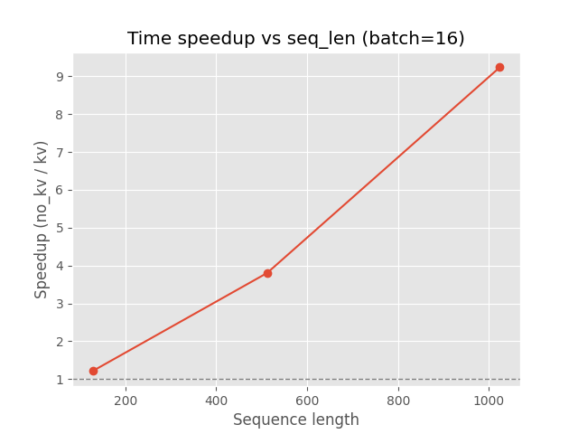

# nanoGPT + KV Cache ⚡

> A small NLP course project: build a decoder-only Transformer from scratch,
> then find out when KV Cache actually makes generation faster.

I first followed Andrej Karpathy's GPT tutorial to understand each part of the
model—token embeddings, masked self-attention, multi-head attention, residual
connections and feed-forward blocks. I then added KV caching and compared it
with full-context recomputation under different sequence lengths and batch
sizes.



## What I built

- a character-level decoder-only Transformer in PyTorch;
- two inference paths: **with** and **without** KV Cache;
- cache reset, position-offset and context-length handling;
- a CUDA benchmark for latency and peak memory;
- plots for time, memory and time–memory trade-offs.

## Experiment

Each configuration was repeated 10 times using a randomly initialized model.
The benchmark compares sequence lengths `128 / 512 / 1024`, batch sizes `1 / 16`,
and 50 generated tokens per run.

| Batch | Sequence length | Speedup (no-KV / KV) |
| ---: | ---: | ---: |
| 1 | 128 | 0.84× |
| 1 | 512 | 0.85× |
| 1 | 1024 | 0.97× |
| 16 | 128 | 1.21× |
| 16 | 512 | 3.80× |
| 16 | 1024 | **9.24×** |

In this setup, cache-management overhead outweighed the benefit for batch size
1, while longer sequences with batch size 16 showed a clear speedup. The
recorded peak-memory result was also lower with KV Cache during generation,
because full-context attention repeatedly created larger intermediate
activations. These results describe this course experiment rather than a
general hardware-independent benchmark.

Raw results: [`benchmark_summary.csv`](results/benchmark_summary.csv) ·
[all figures](results/figures/) ·
[course presentation (12 Dec 2025)](docs/KV_Cache_Performance_Analysis_2025-12-12.pptx)

## Run it

```bash
python -m venv .venv
source .venv/bin/activate
pip install -r requirements.txt

# Check the available GPU
python check_gpu.py

# Run the KV Cache benchmark
python benchmark_kv_cache.py --device cuda --vocab-size 5000 --generate-steps 50
```

To train the character-level model on the included Shakespeare corpus:

```bash
python train_without_kvcache.py
# or
python train_with_kvcache.py
```

## Project map

```text
config.py                     model and experiment settings
model_with_kvcache.py         decoder with per-head K/V buffers
model_without_kvcache.py      full-context baseline
benchmark_kv_cache.py         latency and peak-memory benchmark
train_*.py                    training scripts
analysis/                     plotting and trade-off analysis
results/                      CSV results and generated figures
docs/                         presentation and model notes
nanoGPT-project/              files preserved from my first 2024 upload
```

## Notes

- The baseline was written step by step while following Karpathy's
  [GPT-from-scratch lecture](https://www.youtube.com/watch?v=kCc8FmEb1nY) and
  [`karpathy/nanoGPT`](https://github.com/karpathy/nanoGPT).
- The repository does not include checkpoints or the local virtual environment.
- The CSV files and presentation preserve the results from the original course
  run; they were not re-benchmarked on the machine used to reorganize this repo.

**Jiayin Tian · Xi'an Jiaotong University · NLP course project, 2025**

